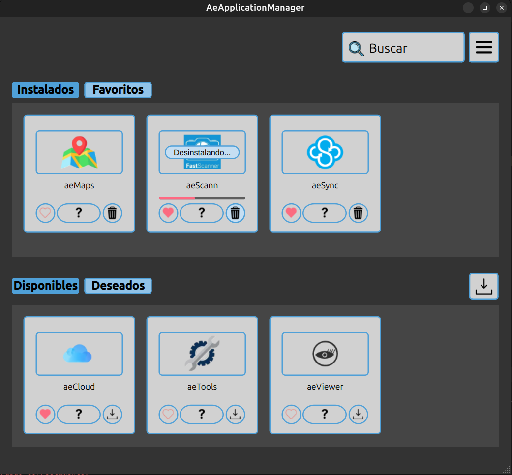
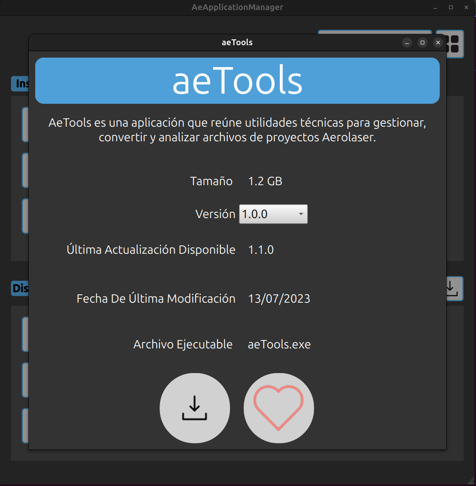
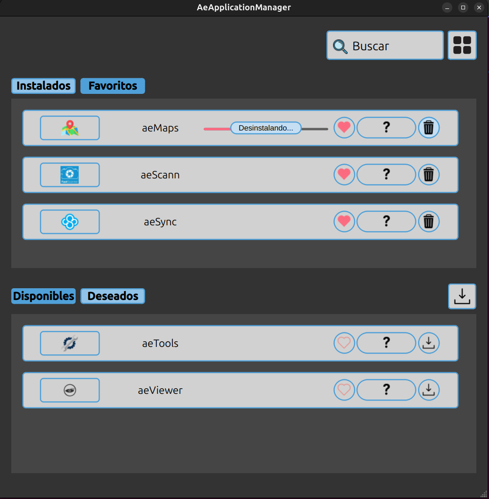
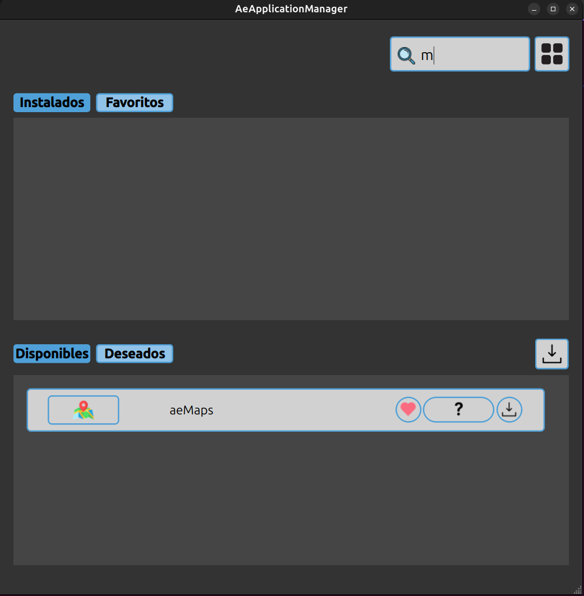

# AeApplicationManager

Desktop application built to manage multiple softwares.

It allows users to handle multiple version installations, manage favorites, and track desired software through a responsive UI.

## ✨ Key Features

* Install or uninstall specific software versions.
* Add apps to favorites to keep track of it.
* Real-time filter to search apps by name.
* Toggle between **List View** and **Grid View**.

## 🛠️ Technologies

## ⚙️ Overview

<table align="center">
  <tr>
    <td align="center">
      
       
      
Grid View Install

    </td>
  </tr>
  <tr>
    <td align="center">
      
       
      
Information Dialog

    </td>
  </tr>
  <tr>
    <td align="center">
      
       
      
List View Uninstall

    </td>
  </tr>
  <tr>
    <td align="center">
      
       
      
Name Filter

    </td>
  </tr>
</table>